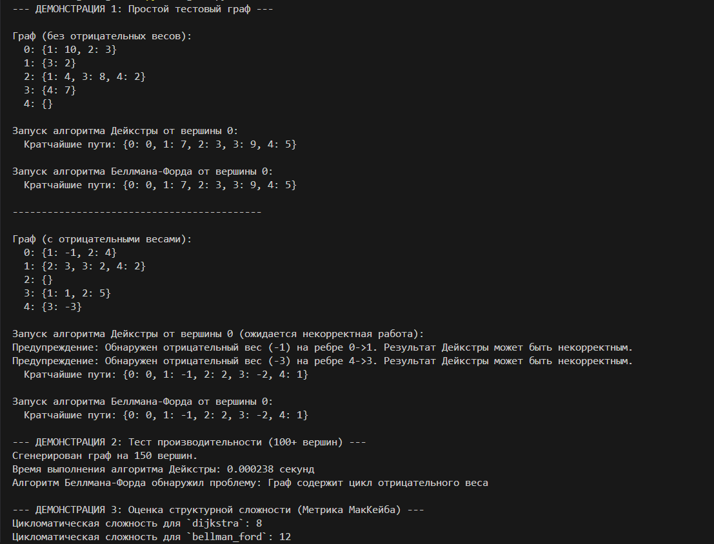

# Реализация алгоритмов маршрутизации (Лабораторная работа)

## Описание проекта

Этот проект представляет собой реализацию и анализ двух классических алгоритмов поиска кратчайшего пути в графе: **алгоритма Дейкстры** и **алгоритма Беллмана-Форда**. Работа выполнена в рамках лабораторной по предмету "Программное обеспечение компьютерных сетей".

Приложение, написанное на Python, демонстрирует:
- Корректность работы алгоритмов на графах с положительными и отрицательными весами рёбер.
- Сравнение производительности алгоритмов на большом графе.
- Оценку структурной сложности кода с использованием метрики МакКейба.

## Функциональность

- **Реализация алгоритма Дейкстры**: Эффективен для графов без рёбер отрицательного веса. Использует приоритетную очередь (`heapq`) для оптимизации.
- **Реализация алгоритма Беллмана-Форда**: Способен работать с графами, содержащими рёбра отрицательного веса, а также обнаруживать циклы с отрицательным весом.
- **Генератор случайных графов**: Функция для создания больших графов (100+ вершин) для тестирования производительности.
- **Сравнительный анализ**: Скрипт замеряет время выполнения обоих алгоритмов.
- **Расчет метрики МакКейба**: Демонстрируется оценка цикломатической сложности для реализованных функций.

## Как запустить

Для запуска проекта вам понадобится **Python 3**.

1.  Клонируйте репозиторий:
    ```bash
    git clone https://github.com/YOUR_USERNAME/routing-algorithms-lab.git
    ```
2.  Перейдите в папку с проектом:
    ```bash
    cd routing-algorithms-lab
    ```
3.  Запустите скрипт:
    ```bash
    python routing_lab.py
    ```

## Демонстрация выполнения кода

Ниже представлен скриншот вывода программы, демонстрирующий все три этапа работы:
1.  Тестирование на простых графах.
2.  Сравнение производительности.
3.  Оценка структурной сложности.

